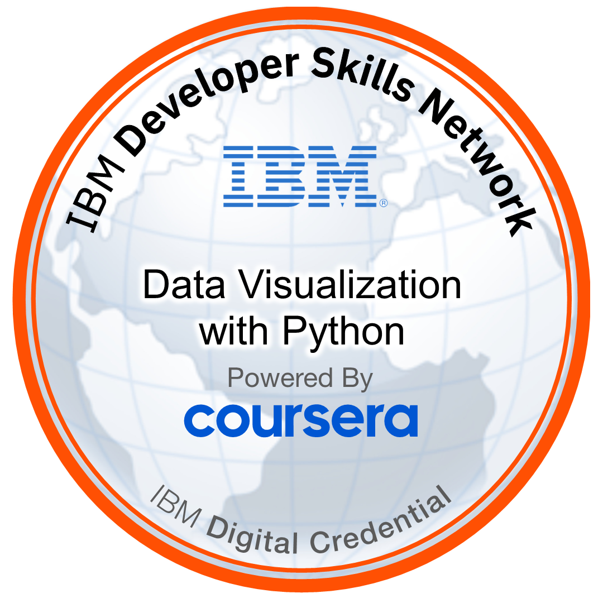
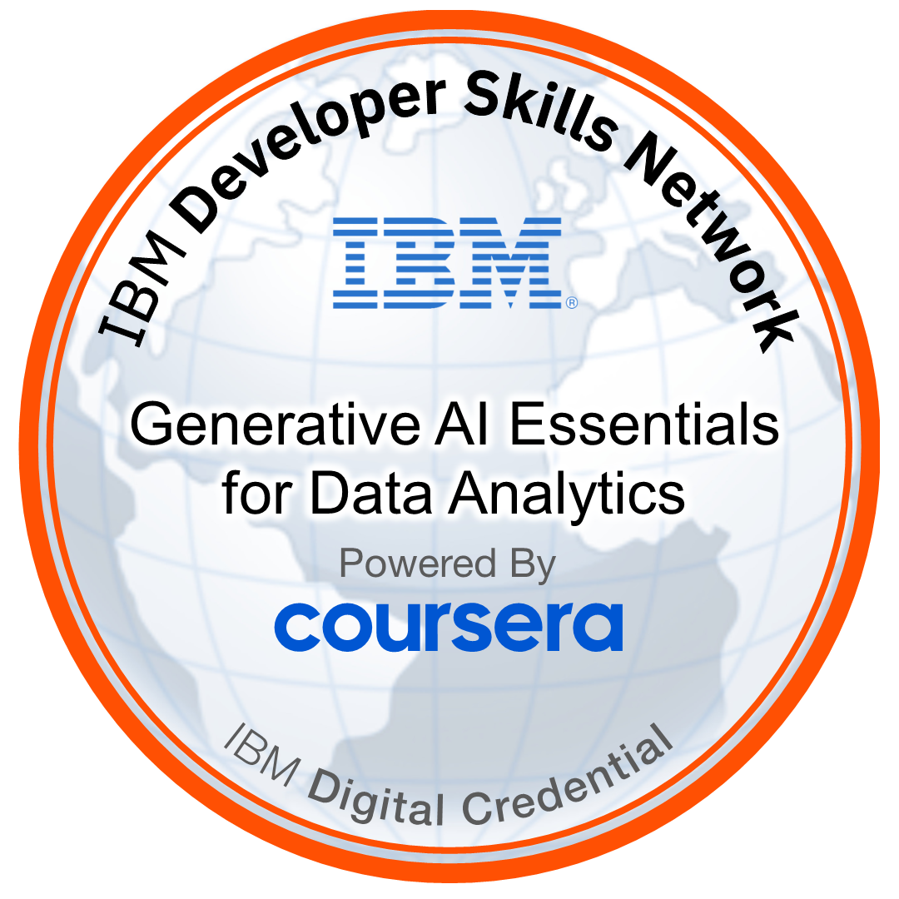

<h1 style="text-align: center; border: none; padding: 0;">Christopher Woodward</h1>

    <a href="#skills">Skills</a> |
    <a href="#continuing-learning">Continuing Learning</a>

### <u>Skills:</u>

* Python
    * Pandas
    * Numpy
    * MatPlotLib
    * Seaborn
    * SKLearn
    * OOP (Object-Oriented Programming)

* Excel

* SQL
    * SQLite
    * SQL Express

* Power Query

* Power BI

# Continuing Learning

# Certificates

